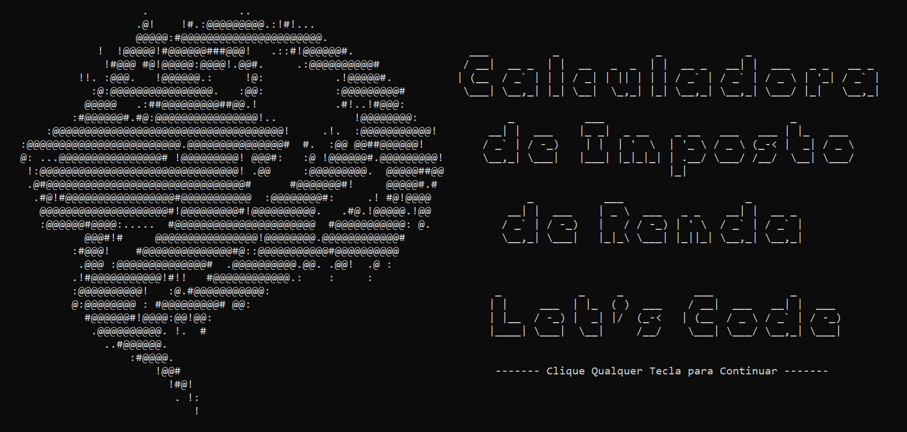

# Projeto Calculadora de Impostos - Feito em C# usando SOLID  
* O projeto tem como ideia base, criar uma calculadora para imposto de renda, usando as regras do SOLID/br>

  

## Como executar
- Clone este repositório em uma pasta local.
- Abra a pasra do projeto com o Visual Studio Community
- Execute o projeto

